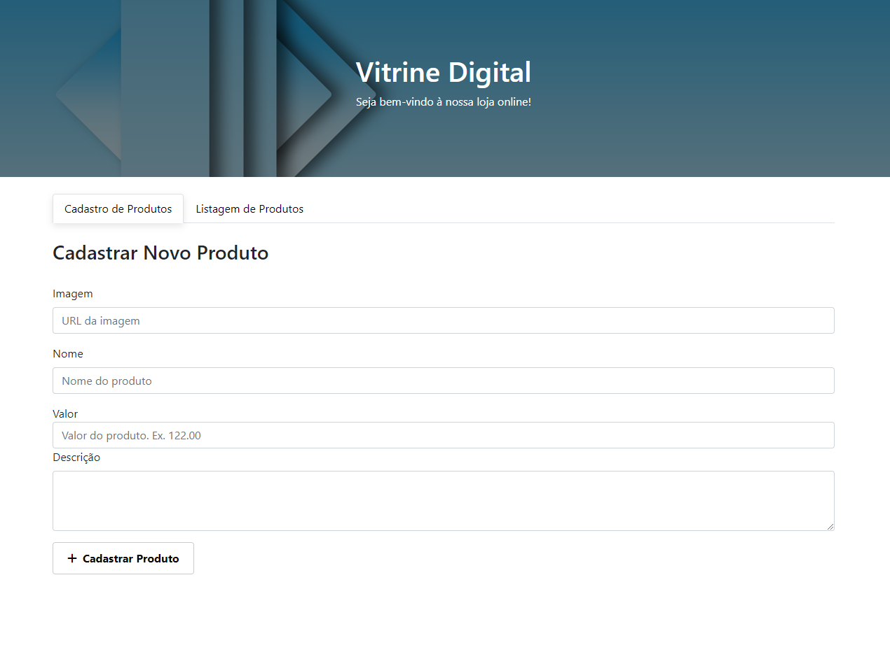
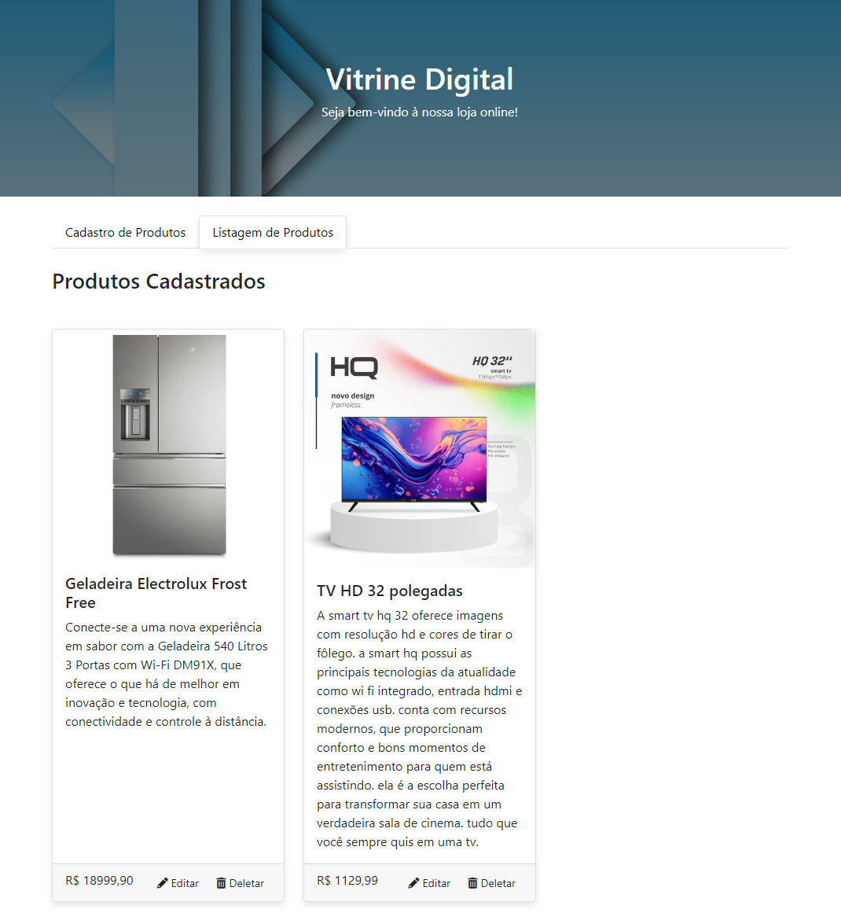

# Gerenciador de Produtos - Frontend

Esta é uma API é um sistema simples de gerenciamento de produtos para uma loja online. O projeto permite cadastrar, listar, editar e excluir produtos, tanto de forma local (temporária) quanto com integração a uma API.

## 🚀 Tecnologias Utilizadas

* HTML

* CSS

* JavaScript puro

* Bootstrap para estilização


## 📌 Funcionalidades

* Cadastro de produtos com nome, imagem, valor e descrição;

* Listagem de produtos cadastrados;

* Edição e remoção de produtos;

* Suporte para funcionamento offline (armazenamento temporário no navegador).

## 📂 Estrutura do Projeto

```
/gerenciador-produtos-front
│── index.html        # Estrutura principal do site
│── style.css         # Estilos CSS
│── script.js         # Lógica do sistema
│── images            # Imagens usadas no README.md
│── README.md         # Documentação do projeto
```
## 📥 Instalação e Execução

### 🔹Requisitos

Para rodar o projeto localmente, é necessário ter:

* Um navegador atualizado (Google Chrome, Firefox, Edge, etc.).

* Um servidor backend rodando na porta 5000 para persistência de dados (opcional).

### 🔹Passos para executar o projeto
1. Clone o repositório
    ```
    git clone https://github.com/keelcoutinho/gerenciador-produtos-front.git
    ```

2. Acesse o diretório do projeto

    ```
    cd gerenciador-produtos-front
    ```

3. Inicie um servidor local (opcional, pode abrir diretamente o HTML no navegador)
    ```
    npx http-server
    ```
4. Abra no navegador

    * Se estiver usando um servidor, acesse: http://localhost:8080

    * Se não estiver usando, basta abrir o index.html no navegador.

## Apresentação de telas

* Aba de cadastro de novos produtos:



* Aba de produtos cadastrados:



## 🛠 Backend (Opcional)

O frontend está preparado para consumir uma API REST. Para rodar o backend, siga as instruções:

1. Importe e instale as dependências do backend:
    * [Link para a API](https://github.com/keelcoutinho/gerenciador-produtos-flask)

2. Inicie o servidor backend na porta 5000.

3. O frontend automaticamente tentará buscar os produtos na API.

## Considerações finais
Este projeto é uma SPA (Single Page Application), usando apenas HTML, CSS e JavaScript, para gerenciamento de produtos. Poderá ser expandido conforme necessário. Contribuições são bem-vindas!